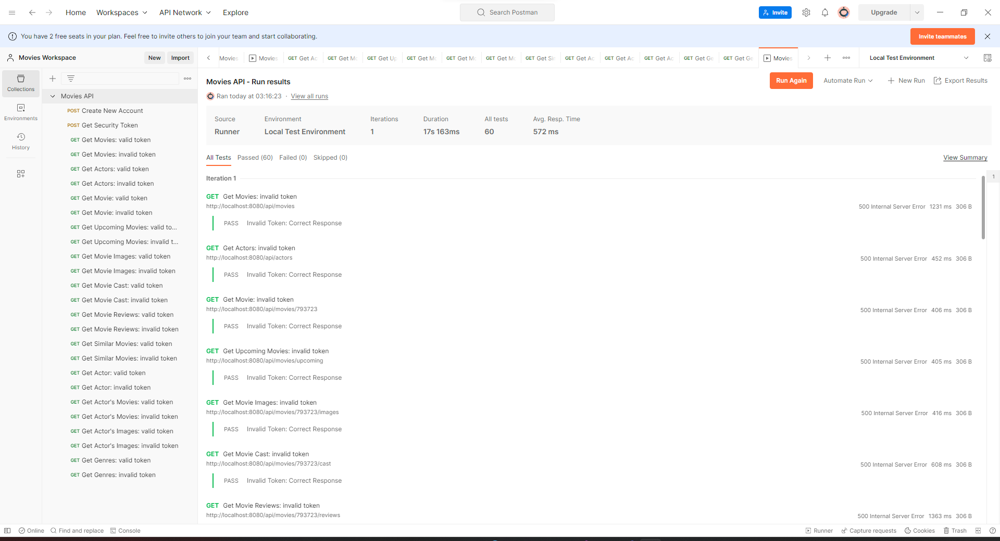
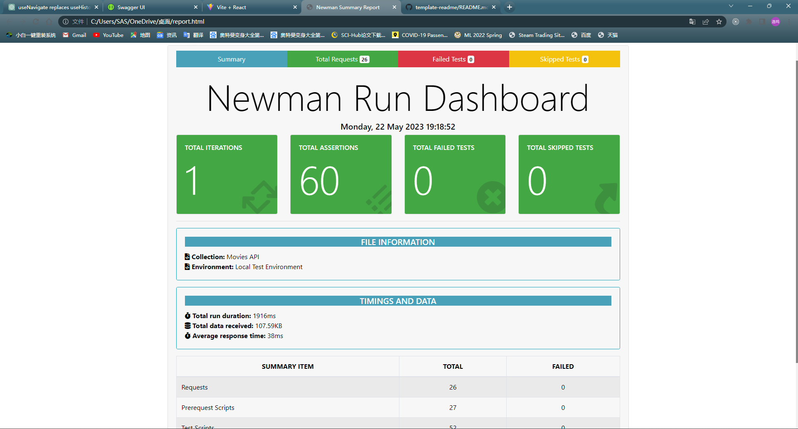
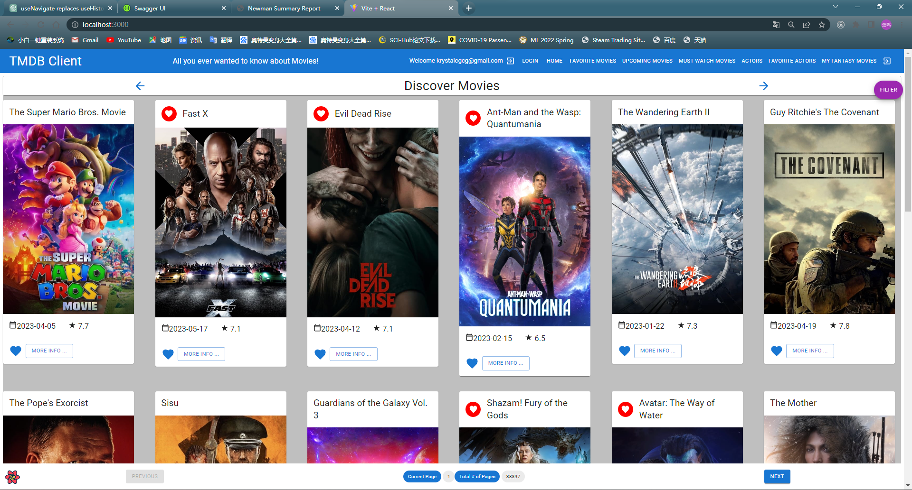
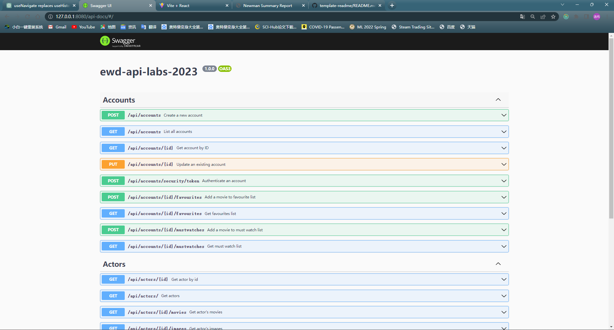

# Assignment 2 - Web API.

Name: Yiming Hu

## Features.

 + Get Upcoming Movies: Get a list of upcoming movies. This endpoint provides users with information about movies that are going to be released in the near future.

 + Get Movie Cast: Get the cast of a specific movie by its ID. This endpoint provides details about the actors and actresses involved in a particular movie.

 + Get Movie Reviews: Get the reviews for a specific movie by its ID. This endpoint allows users to read what others have thought about a specific movie, which can be helpful when deciding whether to watch a movie or not.

 + Get Actor's Movies: Get a list of movies that a specific actor has starred in. This feature can be useful for fans of an actor who want to explore more movies featuring their favorite actor.

 + Get Actor's Images: Get images related to a specific actor. This can include promotional pictures, movie stills, and other images related to the actor.

 + Get Similar Movies:  Get a list of similar movies using a movie ID. 

## Installation Requirements


The API was built in a Codespace.  You can fork or clone the project and create a new codespace to run it.

```cmd
git clone https://github.com/JohnPricehu/ewd-api-labs-2023.git
```

followed by installation

```bat
npm install
```
The front end is a separate project, available here: https://github.com/JohnPricehu/labMoviesApp.git


## API Configuration

Before running the API you need to create an ".env" and put the following variables.


```bat
NODE_ENV=development
PORT=8080
HOST=localhost
DATABASE_DIALECT=mongo
TMDB_KEY=[Your TMBD Key]
DATABASE_URL=mongodb://localhost:27017/movies_db
JWT_SECRET_KEY=ilikecake
```


## API Design
[Give an overview of your web API design, perhaps similar to the following: ]

|  |  GET | POST | PUT | DELETE
| -- | -- | -- | -- | -- 
| /api/movies |Gets a list of movies | N/A | N/A |
| /api/movies/{movieid} | Get a Movie | N/A | N/A | N/A
| /api/movies/{movieid}/reviews | Get all reviews for movie | Create a new review for Movie | N/A | N/A 
| /api/movies	| Gets a list of movies	| N/A	| N/A	| N/A
| /api/movies/{movieid}	| Get a Movie	| N/A	| N/A	| N/A
| /api/movies/{movieid}/reviews	| Get all reviews for movie	| Create a new review for Movie	| N/A	| N/A
| /api/movies/{movieid}/images	| Get all images for a movie	| N/A	| N/A	| N/A
| /api/movies/{movieid}/cast	| Get the cast of a movie	| N/A	| N/A	| N/A
| /api/movies/{movieid}/similar	| Get similar movies for a movie	| N/A	| N/A	| N/A
| /api/movies/upcoming	| Gets a list of upcoming movies	| N/A	| N/A	| N/A
| /api/genres | Gets a list of genres | N/A | N/A |
| /api/actors	| Gets a list of actors	| N/A	| N/A	| N/A
| /api/actors/{actorid}	| Get an Actor	| N/A	| N/A	| N/A
| /api/actors/{actorid}/movies	| Get all movies for an actor	| N/A	| N/A	| N/A
| /api/actors/{actorid}/images	| Get all images for an actor	| N/A	| N/A	| N/A
| /api/accounts	| List all accounts	| Create a new account	| N/A	| N/
| /api/accounts/{accountid}	| Get account by ID	| Update an existing account	| N/A	| N/A 
| /api/accounts/{accountid}/favourites	| Get a account's favourites list	| Add a movie to favourite list	| N/A	| N/A
| /api/accounts/{accountid}/mustwatches	| Get a account's must watch list	| Add a movie to must watch list	| N/A	| N/A
| /api/accounts/security/token	| N/A	| Generate token	| N/A	| N/A 


## Security and Authentication


The API is locked by an authentication header. Basically, the bearer token is passed into the service and authenticated using the Tokenizer framework. In the code, using the controller implementation configured in each routing configuration once the framework is implemented add it is one line of code:
~~~Javascript
router.route('/*').all(accountsController.verify);
~~~
After connecting to the front-end application, I used supabase authentication, and here is the routes with ProtectedRoute (which will not be accessible without logging into the supabase account)
~~~Javascript
<Route element={<ProtectedRoute />}>
  <Route path="/reviews/form" element={<AddMovieReviewPage/>} />
  <Route path="/movies/favourites" element={<FavouriteMoviesPage />} />                  
  <Route path="/movies/mustWatches" element={<MustWatchMoviesPage />} />
  <Route path="/movies/:id" element={<MoviePage />} />
  <Route path="/reviews/:id" element={<MovieReviewPage/>} />
  <Route path="/actors/:id" element={<ActorPage />} />
  <Route path="/actors/favourites" element={<FavouriteActorsPage />} />
  <Route path="/fantasy" element={<FantasyMovieListPage />} />
  <Route path="/fantasy/create" element={<CreateFantasyMoviePage />} />                  
   <Route path="/fantasy/:id" element={<FantasyMovieDetailsPage />} />
</Route>
~~~
## Validation

I continued to use the verification that I had done in the lab, i.e. first and last name were required, the email address had to be in the format of an email address, and the password had to be of a certain length and have a special symbol that included numbers, upper and lower case letters, and a certain number.

But in connection with the front-end application, it will still need to use the Validation of supabase, details can be found in the report of my front-end application.

## Testing
I use Postman requests to test that the API requests I've created are correct before trying to integrate them into the front-end application.




In addition, I used Newman Automation to automatically generate the test reports:


## Integrating with React App

I proxy it through vite.config.js to integrate the front-end application with the API project, as follows:

~~~Javascript
import { defineConfig } from 'vite'
import react from '@vitejs/plugin-react'

// https://vitejs.dev/config/
export default defineConfig({
  plugins: [react()],
  server: {
    port: 3000,
    proxy: {
      '/api': {
        target: 'http://127.0.0.1:8080',
        changeOrigin: true,
        secure: false
      }
    }

  }
})

~~~

The code for calling the API in the front-end is as follows：

~~~Javascript
export const getMovies = (page = 1) => {
  return fetch(
    `/api/movies?page=${page}`, {
      headers: {
        'Authorization': window.localStorage.getItem('token')
      }
    }
  ).then((res) => res.json())
  .catch((error) => {
    throw error;
  });
};


~~~

You can use the API normally in the front-end application after logging in:



## Extra features

I used Swagger to organize all the APIs and generate the documentation：



## Independent learning.

